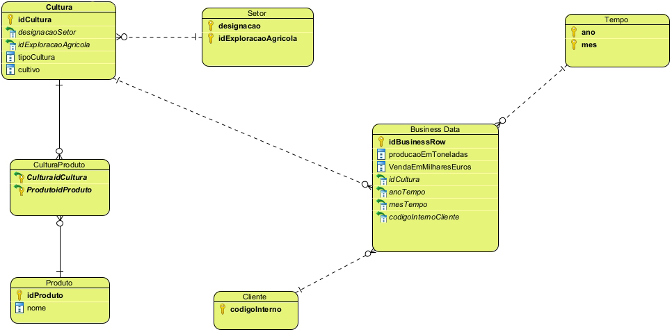

#Descrição US214

##Objetivo
Este user story diz respeito ao desenvolvimento de um modelo de dados para construir um <span style="color: #d97a6a">**Data Warehouse**</span> para análise de produção e vendas de uma empresa agrícola. 
O objetivo é ter uma ferramenta de análise de dados que permita obter informações sobre a produção e as vendas da empresa, de forma a ajudar na tomada de decisões e no planeamento estratégico.

Para isso, serão considerados dois factos: <span style="color: #d97a6a">**produção em toneladas**</span> e <span style="color: #d97a6a">**vendas em milhares de euros**</span>. 
As dimensões a serem consideradas são Tempo, Setor, Produto e Cliente. 
A dimensão Tempo terá uma hierarquia com os níveis Ano e Mês, enquanto a dimensão Produto terá uma hierarquia com os níveis Tipo de cultura e Cultura.

O modelo de dados deverá seguir o padrão Star ou Snowflake, conforme o que for mais adequado para atender às necessidades de análise do Data Warehouse. 
Além disso, será necessário estimar a <span style="color: #d97a6a">**cardinalidade**</span> das tabelas de dimensões e factos, justificando essa estimativa.

Para finalizar, serão criados <span style="color: #d97a6a">scripts SQL</span> para carregar o esquema do Data Warehouse com dados suficientes para uma prova de conceito e para consulta, 
respondendo a perguntas sobre a evolução da produção de uma determinada cultura, a comparação de vendas entre anos e a análise da evolução das vendas mensais por tipo de cultura.

------------------------------------------------------------------------------------------------------------------------------------

##Modelo Snowflake
O modelo de dados <span style="color: #d97a6a">**Snowflake**</span> é um modelo de armazenamento de dados em nuvem projetado para facilitar a análise de quantidades abundantes de dados. 
Este é baseado no modelo de dados estrela, que consiste em tabelas de dimensão e tabelas de factos.

As tabelas de <span style="color: #d97a6a">**dimensão**</span> são tabelas que descrevem os atributos de um dado, como data, local, produto, etc. 
Estas são usadas para fornecer contexto aos dados armazenados nas tabelas de factos. 
As tabelas de dimensão são normalmente usadas para filtrar e agrupar os dados, permitindo que os utilizadores façam perguntas específicas sobre os dados.

As tabelas de <span style="color: #d97a6a">**factos**</span>, por outro lado, armazenam os dados <span style="color: #d97a6a">**quantitativos**</span> ou <span style="color: #d97a6a">**mensuráveis**</span>, como vendas, quantidade de produtos vendidos, etc. 
Estas são usadas para armazenar os dados usados para medir o desempenho de uma empresa ou organização.

O modelo de dados Snowflake é ideal para análise de quantidades substanciais de dados, pois permite que os utilizadores façam perguntas específicas sobre os dados de forma rápida e eficiente. 
Ele também é escalável, o que significa que pode ser facilmente ajustado à medida que a quantidade de dados aumenta.

------------------------------------------------------------------------------------------------------------------------------------

##Tabelas de Dimensão

###Setor
Armazena informações sobre os setores de uma exploração agrícola, como a designação e o ID da exploração agrícola a que pertence. 
A sua chave primária é então composta pelos campos <span style="color: #b392f0">**_designacao_**</span> e <span style="color: #b392f0">**_idExploracaoAgricola_**</span>.

###Cultura
Aarmazena informações sobre as culturas de uma exploração agrícola, como o ID da cultura, a designação do setor a que pertence, e o devido ID da exploração agrícola a que pertence, 
o tipo de cultura (permanente ou temporária) e o cultivo. Esta tabela possui uma restrição de verificação que garante que o campo _tipoCultura_ só pode conter os valores _'P'_ ou _'T'_. 
A chave primária desta tabela é o campo <span style="color: #b392f0">**_idCultura_**</span> e existe uma chave estrangeira que referencia a tabela Setor pelos campos designacaoSetor e idExploracaoAgricola.

###Cliente
Armazena informações sobre os clientes de uma exploração agrícola, como o código interno de cada cliente. A chave primária desta tabela é o campo <span style="color: #b392f0">**codigoInterno**</span>.

###Tempo
Armazena informações sobre o tempo, como o ano e o mês. A chave primária desta tabela é composta pelos campos <span style="color: #b392f0">**ano**</span> e <span style="color: #b392f0">**mes**</span>.

###Produto
Armazena informações sobre os produtos de uma exploração agrícola, como o ID do produto e o nome do produto. A chave primária desta tabela é o campo <span style="color: #b392f0">**idProduto**</span>


##Tabelas de Facto

Por fim, a tabela BusinessData armazena informações sobre os dados de negócios de uma exploração agrícola, 
```
* Producao em toneladas
* Vendas em milhares de euros
* Desinação do Setor
* ID da Exploração Agrícola
* ID do Produto
* Mês e Ano
* Código interno do Cliente
```
Esta tabela possui restrições de chave estrangeira que referenciam as tabelas Setor, Produto, Tempo e Cliente. 
A chave primária desta tabela é o campo <span style="color: #b392f0">**idBusinessRow**</span>, que é automaticamente gerado como um valor único para cada linha inserida.

------------------------------------------------------------------------------------------------------------------------------------

#Cardinalidade

##Definição/Explicação

_Cardinalidade de um modelo refere-se à relação entre duas entidades_. 
Ela pode ser descrita como a quantidade de ocorrências de uma entidade que podem ou devem estar associadas a uma ocorrência de outra entidade.

Há três tipos básicos de cardinalidade:

**Um para Um (1:1):** 
```
Cada ocorrência de uma entidade está associada a no máximo uma ocorrência de outra entidade. 
Por exemplo, cada pessoa pode ter apenas um passaporte.
```
**Um para Muitos (1:N):** 
```
Cada ocorrência de uma entidade está associada a uma ou mais ocorrências de outra entidade. 
Por exemplo, cada departamento pode ter vários funcionários, mas cada funcionário pertence a apenas um departamento.
```

**Muitos para Muitos (N:N):** 
```
Cada ocorrência de uma entidade pode estar associada a uma ou mais ocorrências de outra entidade, e vice-versa. 
Por exemplo, um estudante pode ter várias matérias, e uma matéria pode ser associada a vários estudantes.
```

A cardinalidade é importante porque determina como as entidades se relacionam dentro de um modelo de dados e como os dados podem ser consultados e manipulados. 
Esta é também um fator importante na normalização de uma base de dados, pois pode ajudar a evitar redundâncias e dependências funcionais indesejadas.

##Nossa cardinalidade
Como é visível na imagem do nosso modelo de dados (em baixo), a cardinalidade das nossas tabelas é a seguinte:

Setor -> 1:N -> Cultura
```
Um setor pode ter várias culturas, mas uma cultura só pode pertencer a um setor.
```

Cultura -> 1:N -> CulturaProduto -> N:1 -> Produto
```
Uma cultura pode ter vários produtos, e um produto pode ser associado a várias culturas.
```

Cultura -> 1:N -> BusinessData
```
Uma cultura pode ter várias linhas de dados de negócio, mas uma linha de dados de negócio só pode pertencer a uma cultura.
```

Cliente -> 1:N -> BusinessData
```
Um cliente pode ter várias linhas de dados de negócio, mas uma linha de dados de negócio só pode pertencer a um cliente.
```

Tempo -> 1:N -> BusinessData
```
Um mês e ano podem ter várias linhas de dados de negócio, mas uma linha de dados de negócio só pode pertencer a um mês e ano.
```

Do conjunto Setor, Cultura e Produto, apenas a <span style="color: #b392f0">Cultura</span> se encontra na tabela BusinessData, pois através desta consigo <span style="color: #d97a6a">facilmente</span>
obter as informações de Setor e Produto, através das chaves estrangeiras.

#Modelo Snowflake
