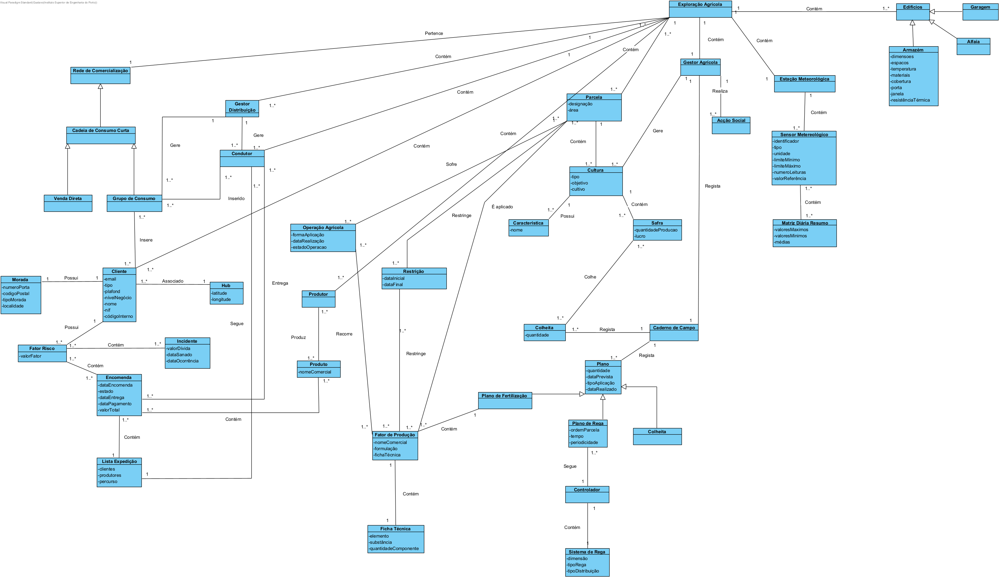

# FarmPlus #

### Project Description ###

FarmPlus is an application that allows consumers and producers to interact through a distribution network.

With FarmPlus, users can have their orders satisfied and delivered to their nearest hub, promoting a more sustainable and efficient food distribution system.
Producers can also use FarmPlus to consult statistics about their products and their sales.

Beyond promoting a more sustainable food distribution system, this application also allows a more efficient treatment of hydric resources.

### Project Goals ###

This project was developed as part of the course "Informatics Engineering" at the Instituto Superior de Engenharia do Porto (ISEP), in the first semester of 2022/2023 academic year.
The **main** goal, was to create a software application that would allow the interaction between consumers and producers, through a distribution network.
Having this in mind, we had to be capable of analyzing, designing and implementing a solution that would satisfy the requirements of the project.

To achieve this goal, we followed the Agile methodology, using the Scrum framework, and the Jira platform to manage the project.
Also, we used the Git version control system to manage the code.
Has part of the requirements, we had to use the Java, C, x86-64 assembly and PL/SQL programming languages.
To perform unitary tests, we used the JUnit framework.

### Project Team ###

- [Guilherme Sousa] - 1211073@isep.ipp.pt
- [Gustavo Jorge] - 1211061@isep.ipp.pt
- [João Leitão] - 1211063@isep.ipp.pt
- [João Rodrigues] - 1211016@isep.ipp.pt
- [Pedro Monteiro] - 1211076@isep.ipp.pt

### Project Structure ###

The project is divided into 4 main parts:

- Fully interactive application, developed in Java, that has a graphical user interface (GUI), developed using JavaFX and CSS, and has all the required functionalities to allow the interaction between consumers and producers.
- Fully interactive application, developed in C/Assembly, that has a console user interface and has all the required functionalities to simulate the working of various types sensors.
- Database, developed in PL/SQL, that stores all the information about the users, products, orders, etc... Together with Scripts to populate the database with some initial data and performing operations over the data.
- Finally, we have the documentation relative to some warehouses, that are fundamental to the good functioning of real life agricultural explorations.

Running the application for the first time can be overwhelming, but we have a set of User Guides and Reports that will help you to get started.

### Project Retrospective ###

This project was a great learning experience for all of us.
With nearly two and a half months, almost **450** hours of work, and a lot of effort, we were able to create a fully functional application, that satisfies all the requirements of the project.
We learned a lot of all the referred technologies, and we are very proud of the result.

Of course, not everything went as planned, and we had some difficulties along the way.
Such as, the lack of experience with some technologies and inaccurate estimations of the time needed to complete a task.

But, we are very happy with the result, and we hope that you enjoy using our application.

### Project Domain Model ###

